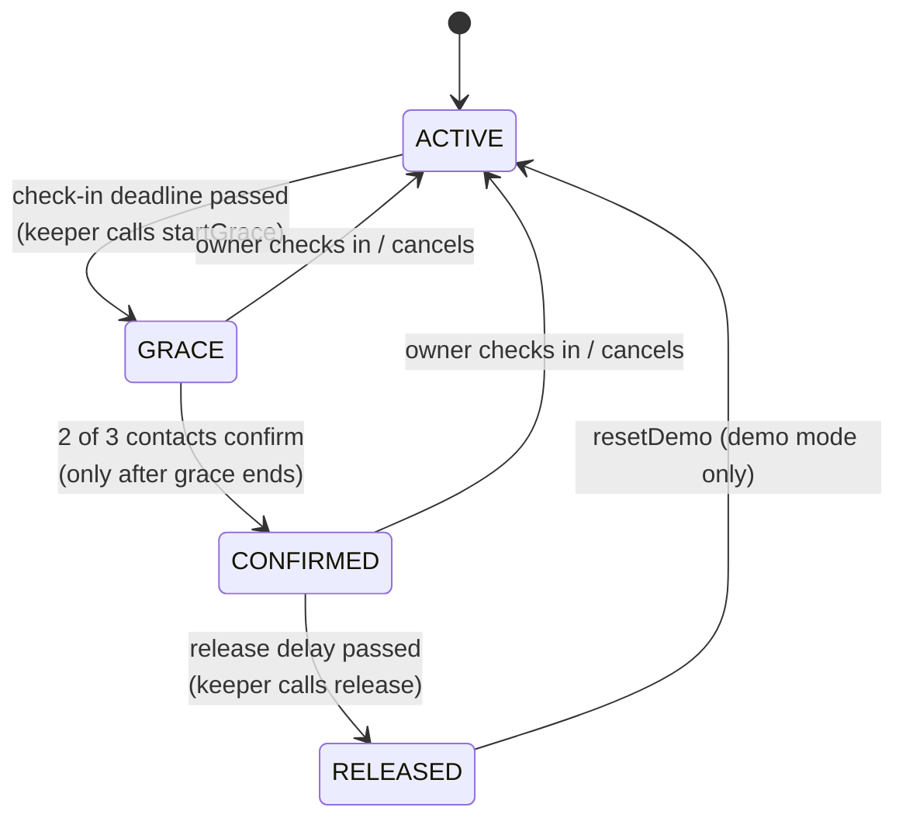
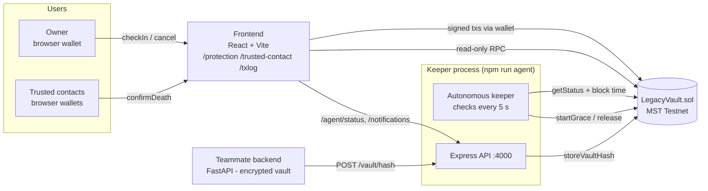

# LegacyVault: Blockchain + Autonomous Keeper

> A dead man's switch for your digital legacy. If you stop checking in, your trusted people
> get access, but only after a grace period, a 2-of-3 confirmation and a safety delay,
> all enforced by a smart contract on **MST Testnet**.

This repository is the **blockchain + autonomous keeper module** of the LegacyVault hackathon
project: the smart contract, the keeper agent and its API, and the web UI for owners and trusted contacts.
The encrypted vault storage and backend live in the teammates' modules. They connect here through
`POST /vault/hash` (see [docs/VAULT_HASH_API.md](docs/VAULT_HASH_API.md)).

> **Prototype.** The contract **does not hold or transfer funds**. Only addresses, state, timestamps
> and one `bytes32` hash are stored on-chain.

---

## The problem

When someone dies or becomes incapacitated, their family often can't find or access important
information: which accounts exist, where the documents are, who to contact. Today's options are poor:

- **A written note or a password manager's "emergency access"** depends on a single company,
  and has no trustworthy record of *when* and *why* access was granted.
- **A lawyer or will** is slow, expensive, and not built for digital information.
- **Sharing passwords early** is insecure and gives access to someone who is still alive.

The hard part is not storing the data. It is deciding, **fairly and verifiably**, that the moment to
release it has come, without trusting a single person or company, and without releasing it by mistake.

## The solution

LegacyVault turns that decision into a transparent, rule-based process:

1. **Check-in.** The owner proves they're alive by clicking *"I'M STILL HERE"* (demo: every 60 s; real: every 30 days).
2. **Grace.** If a check-in is missed, the **keeper agent** starts a grace period. The owner can still respond.
3. **Confirmation.** Only after grace ends can the **trusted contacts** confirm. **2 of 3** must agree.
4. **Safety delay.** After confirmation, a short delay gives a living owner one last chance to cancel.
5. **Release.** The keeper marks the vault **RELEASED**. That public, verifiable state is the signal the
   backend uses to release access to the encrypted vault, whose integrity is proven by the hash stored on-chain.

At any point before release, one owner check-in cancels everything and starts a new round.



## Architecture



| Part | What it does | Code |
|---|---|---|
| **Smart contract** | Holds the state machine, deadlines, contacts, confirmations and vault hash. Enforces every rule. | `contracts/LegacyVault.sol` |
| **Keeper agent** | Reads `getStatus()` every 5 s. Sends reminders. Calls `startGrace()` / `release()` when the rules allow. | `agent/keeper.ts` |
| **API** | Heartbeat, notifications and contract info for the UI. `POST /vault/hash` for the backend. | `agent/server.ts` |
| **Frontend** | Owner dashboard, trusted-contact confirmation page, live transaction log. | `frontend/` |
| **Scripts** | Wallets, funding, deploy, manual CLI, end-to-end scenarios. | `scripts/` |

### Why blockchain?

- **No single party can cheat.** Not us, not a contact, not a company. The rules (deadlines, 2-of-3,
  delays) are public code that nobody can change or bypass after deployment.
- **Verifiable timeline.** Every check-in, confirmation and release is a timestamped, public
  transaction. Anyone can audit *who* did *what* and *when* (see `/txlog`).
- **It outlives us.** The vault state stays on-chain even if our servers disappear.
- **Integrity proof.** The stored hash proves the encrypted vault wasn't swapped or edited later.

### Why an autonomous agent?

Smart contracts can't wake themselves up. Something has to notice that a deadline passed and send
a transaction. The keeper does that automatically, and also sends reminders and notifications.

**The agent is not trusted.** It can only call functions the contract allows at that moment
(`startGrace` only after the deadline, `release` only after confirmation + delay). Anyone else could
call them too. If the agent is offline, the process is only delayed, never corrupted.

## Security design

- **No funds.** No `payable` functions, and no transfers or external calls in the contract.
- **No personal data on-chain.** Only addresses, the state enum, timestamps, counters and one `bytes32` hash.
- **Owner always has the last word before release.** `checkIn()` works in GRACE and CONFIRMED, `cancel()` works in both, and
  `release()` waits for a delay after the 2nd confirmation.
- **Contacts can't rush it.** `confirmDeath()` is only allowed *after* the grace deadline, once per contact per round.
- **No stale votes.** Confirmations are stored per `round`, and every reset increments the round.
- **Contacts can't be swapped mid-process.** `setTrustedContacts()` only works in ACTIVE, with exactly 3 unique
  contacts, no zero address, and not the owner.
- **Block time, not laptop time.** The keeper uses the latest block's timestamp for every deadline decision.
- **Keys.** Throwaway testnet keys live only in `.env` (gitignored) and are never printed.
  `POST /vault/hash` requires a shared API key, compared in constant time.
- **Trusted Circle on-chain.** A contact must call `acceptRole()` before `confirmDeath()` works (`ContactNotAccepted` otherwise). Replacing the contact list clears all acceptances, and `declineRole()` stops future confirmations.
- **Tested.** 26 unit tests cover every rule and every unauthorized path (`npm test`).

## How to run

Requirements: **Node 20+**, a browser wallet (MetaMask or BridgeKey) for the UI, Windows PowerShell or any shell.

```powershell
npm install
npm --prefix frontend install
npm test                         # 26 passing
npm run wallets                  # creates .env with 5 throwaway wallets (prints addresses only)
```

`.env` holds `NETWORK=local` or `NETWORK=mst`. Everything (scripts, keeper, UI) follows it.

### A) Local chain (no tokens needed)

```powershell
# window 1
npm run node:local
# window 2
npm run setup:local              # 1 block/s + gives our wallets local test ETH
npm run deploy                   # writes deployment.json, abi/, CONTRACT_ADDRESS in .env
npm run agent                    # keeper + API on :4000
# window 3
npm run frontend                 # http://localhost:5173
```

### B) MST Testnet

1. Fund the **owner** address (printed by `npm run wallets`) at https://faucet.mstblockchain.com/.
2. Set `NETWORK=mst` in `.env`.
3. Run:

```powershell
npm run fund                     # owner -> keeper + 3 contacts (small tMSTC amounts)
npm run deploy                   # prints CONTRACT DEPLOYED + MSTScan links
npm run agent
npm run frontend
```

MST reports `baseFee = 0` and no EIP-1559 fee data, so every transaction (scripts, keeper, UI)
is sent as **legacy type 0 with an explicit gasPrice** (1 gwei).

### Useful commands

| Command | What it does |
|---|---|
| `npm run vault -- status` | Full vault status (chain time, deadlines, contacts, hash) |
| `npm run vault -- checkin` / `cancel` / `reset` | Owner actions |
| `npm run vault -- confirm 1` | Trusted contact 1 confirms (`1`, `2` or `3`) |
| `npm run vault -- hash 0x…` | Owner stores a vault hash |
| `npm run scenario:release` | End-to-end release demo with real txs (keeper must be running) |
| `npm run scenario:recovery` | End-to-end recovery demo (miss → grace → owner returns) |

### API (keeper, port 4000)

| Endpoint | Purpose |
|---|---|
| `GET /agent/status` | Heartbeat. ONLINE if the last check was less than 3 intervals ago. |
| `GET /notifications` | Latest 50 keeper notifications |
| `GET /contract` | Address, chainId, RPC, explorer, deploy block, ABI |
| `POST /vault/hash` | `{ vaultHash }` + `x-api-key`. The keeper stores it on-chain. See [docs/VAULT_HASH_API.md](docs/VAULT_HASH_API.md). |

### Amanat backend adapter (port 8100)

`npm run agent` also starts an adapter that speaks the interface in `contract/README.md`, so the team
backend can use it: set `AMANAT_KEEPER_URL=http://127.0.0.1:8100` in `backend/.env`. Tested against
the real backend: `/status` is served from the keeper, and `/demo/load` puts the vault hash on MST.

| Route | What happens |
|---|---|
| `GET /status` | Live on-chain state in the `shared/mock/status.json` shape, plus extras (`round`, `contract`, `release_at`) |
| `GET /txlog` | All contract events, oldest first, in the `shared/mock/txlog.json` shape with MSTScan links. Reminders appear as `ReminderSent` with `tx_hash: null`. |
| `POST /vault-hash`, `/activate` | Keeper stores the hash on-chain. Skipped if it's already the current hash. |
| `POST /contacts`, `/contact-status` | Names and relations saved **off-chain** (`agent/data/circle.json`, no phone numbers) for display. On-chain wallets unchanged. |
| `POST /beneficiaries` | Acknowledged. Names and shares never go on-chain. |
| `POST /checkin` | **Demo custodial:** the keeper signs `checkIn()` with the owner key from `.env`. In GRACE/CONFIRMED this cancels. |
| `POST /confirm {contact_index}` | **Demo custodial:** the keeper signs `confirmDeath()` with that contact's key, after checking it's the on-chain contact. Too early or a repeat gives 409. |
| `POST /demo/reset` | **Demo custodial**, demo mode only: RELEASED → `resetDemo()`, GRACE/CONFIRMED → `cancel()`. The backend's `/demo/reset` can call this. |
| `POST /demo/miss-deadline` | No transaction (a real chain's clock can't be skipped). With demo timers, grace starts automatically within about 35 s. |

**Custodial signing is demo-only and opt-in** (`ADAPTER_CUSTODIAL=true`; default `false`, which makes those routes return 501).
The keeper process then holds the owner's and contacts' testnet keys. In production, everyone signs with their own wallet.
Tested through the real backend: owner check-in → keeper grace → an unaccepted contact is refused (backend 403)
→ early confirm refused (409) → 2 accepted contacts confirm → keeper release → family SMS + beneficiary view unlocked.

**Security:** the backend sends no auth header, so the adapter only accepts `127.0.0.1` by default. If the backend
runs on another laptop, set `ADAPTER_HOST=0.0.0.0` and `ADAPTER_ALLOWED_IPS=<backend laptop IP>`.

## Deployment

| Network | Contract | Deploy block | Explorer |
|---|---|---|---|
| **MST Testnet (91562037)**, current, demo timers 60 s / 60 s / 20 s | [`0x9037DaF86528205F84572B93BdeCb4EA8fE8557A`](https://testnet.mstscan.com/address/0x9037DaF86528205F84572B93BdeCb4EA8fE8557A) | 5802714 | see contract page |
| MST Testnet, second version (retired, 30 s / 30 s / 15 s) | `0xB06b7eCBe33D83D1b3DC3fC91ebe4879FDb727Cd` | 5789851 | - |
| MST Testnet, first version (retired, no `acceptRole`) | `0x0ABa512a119fc62E74468B78c93A1B7e1dD4507D` | 5787822 | - |
| Local Hardhat (31337) | any `npm run deploy` with `NETWORK=local` | - | n/a |

Verified on MST with real transactions: the keeper auto-starts grace and auto-releases, and both demo scenarios
(`npm run scenario:release` about 2 min, `npm run scenario:recovery` about 1 min) passed twice in a row. `/vault/hash` stored a hash on-chain.
The keeper used about 0.00035 tMSTC for 7 transactions.

Measured gas (Hardhat, identical on MST): deploy about 1.57M, `checkIn` about 36–47k, `startGrace` about 72k,
`confirmDeath` about 79–91k, `release` about 30k, `storeVaultHash` about 31k. At MST's 1 gwei, one full
cycle costs well under 0.001 tMSTC.

## Project structure

```
contracts/LegacyVault.sol     the contract
test/LegacyVault.test.ts      26 tests (Hardhat + chai + time helpers)
scripts/                      generate-wallets, fund-wallets, deploy, interact, export-abi,
                              local-setup, scenario, common (shared helpers)
agent/                        config, stateMachine (shared with UI), keeper, notifier, server
agent/data/                   heartbeat + notifications (gitignored, created at runtime)
frontend/                     Vite + React + TS (pages: protection, trusted-contact, txlog)
abi/LegacyVault.json          ABI for other modules
deployment.json               address, deployBlock, chainId, params
docs/VAULT_HASH_API.md        backend integration guide
DEMO_SCRIPT.md, JUDGES_QA.md  demo run-sheet and judge Q&A
```

## Limitations (honest list)

- **Prototype on testnet** with demo timers (60 s / 60 s / 20 s). Not audited.
- **One contract per owner**, and contacts must have a wallet with a little gas to confirm.
- **Keeper key can overwrite the vault hash** (by design, so the backend can update it). A compromised keeper
  key could store a wrong hash, but could not release anything early. Production: owner-signed hashes or a hash history.
- **One keeper instance.** If it's offline, anyone can call `startGrace`/`release`, but no one is *reminded*.
- **Notifications** are in-app only (toasts + API). There is no email or SMS yet.
- **The event log** is read with chunked `queryFilter` calls. Fine for a demo; production would use an indexer.
- **"Death" is a social decision** by 2 of 3 contacts, not a legal one. The delays reduce, but can't remove, the
  risk of 2 colluding contacts acting while the owner is unreachable.
